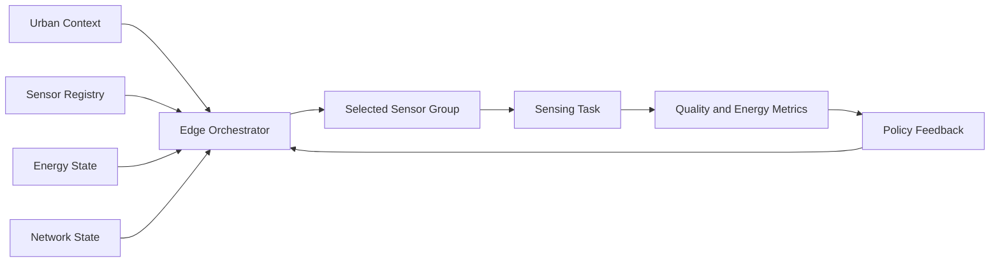

<p align="center">
  
</p>

<h1 align="center">Adaptive Edge Sensor Orchestration Lab</h1>

<p align="center">
  <b>An academic AIoT research prototype for adaptive sensor group selection, edge scheduling, and energy-quality trade-off analysis in synthetic smart-city sensing scenarios.</b>
</p>

<p align="center">
  
  
  
  
  
</p>

---

## Overview

**Adaptive Edge Sensor Orchestration Lab** studies how edge intelligence can decide which sensors should remain active, standby, or inactive under changing urban sensing conditions. The project focuses on **adaptive sensor group selection**, **energy-aware scheduling**, **sensing-quality preservation**, and **reproducible evaluation**.

The repository is designed as an academic scaffold for AIoT, edge AI, smart-city sensing, and sustainable computing. It uses synthetic scenarios and does not make deployment claims.

---

## Research Question

> **Can adaptive edge orchestration reduce sensing energy cost while preserving sufficient sensing quality for smart-city analytics?**

---

## Research Objectives

| Objective | Description |
|---|---|
| Adaptive sensor selection | Select a useful sensor group instead of activating every available sensor. |
| Energy-quality trade-off | Balance reduced energy cost with coverage, reliability, and latency needs. |
| Edge scheduling | Assign active, standby, or inactive modes to each sensor. |
| Context awareness | Adapt to traffic density, weather, battery level, reliability, and network load. |
| Reproducible evaluation | Compare static, random, and adaptive policies under shared synthetic scenarios. |

---

## Edge Orchestration Architecture

<p align="center">
  
</p>



---

## Adaptive Selection Workflow

<p align="center">
  
</p>

| Step | Purpose |
|---|---|
| Observe context | Read synthetic urban state such as traffic density, weather, priority, and network load. |
| Score sensors | Estimate utility from coverage, reliability, battery, latency, and sensing relevance. |
| Select group | Choose a compact group that meets a quality target with lower energy cost. |
| Schedule modes | Assign active, standby, or inactive status for each sensor. |
| Evaluate trade-off | Report energy saving, quality score, latency risk, and sensor-use balance. |

---

## Energy-Quality Dashboard Concept

<p align="center">
  
</p>

---

## Quick Start

```bash
git clone https://github.com/Hirakhyzer/adaptive-edge-sensor-orchestration-lab.git
cd adaptive-edge-sensor-orchestration-lab
python -m venv .venv
source .venv/bin/activate  # Windows: .venv\\Scripts\\activate
python -m pip install --upgrade pip
python -m pip install -r requirements.txt
python examples/run_orchestration_demo.py
pytest
```

---

## Repository Structure

```text
adaptive-edge-sensor-orchestration-lab/
├── assets/
│   ├── banner.svg
│   ├── sensor-orchestration-architecture.svg
│   ├── adaptive-selection-workflow.svg
│   └── energy-quality-dashboard.svg
├── data/
│   └── scenario_templates.json
├── docs/
│   ├── research-background.md
│   ├── system-design.md
│   ├── evaluation-methodology.md
│   ├── responsible-aiot-boundary.md
│   └── scenario-catalogue.md
├── examples/
│   └── run_orchestration_demo.py
├── src/edge_sensor_orchestration/
│   ├── schema.py
│   ├── orchestrator.py
│   ├── simulation.py
│   └── evaluation.py
└── tests/
    └── test_orchestration.py
```

---

## Responsible AIoT Boundary

This repository is for synthetic experimentation, research, and education. It does not operate real devices, control physical infrastructure, collect personal data, or provide deployment instructions. Any real-world use would require safety, privacy, cybersecurity, and governance review.

---

## Expected Contributions

- A reusable AIoT framework for adaptive sensor group selection.
- A simple edge orchestration policy for energy-aware sensing.
- Synthetic scenarios for evaluating sensor scheduling decisions.
- Metrics for energy-quality trade-offs, latency risk, and sensor utilisation fairness.
- Research documentation for sustainable and responsible urban sensing.

---

## License

Released under the [MIT License](LICENSE).

---

## Author

Created by **Hira Khyzer** as an academic AIoT and smart-city sensing research prototype.