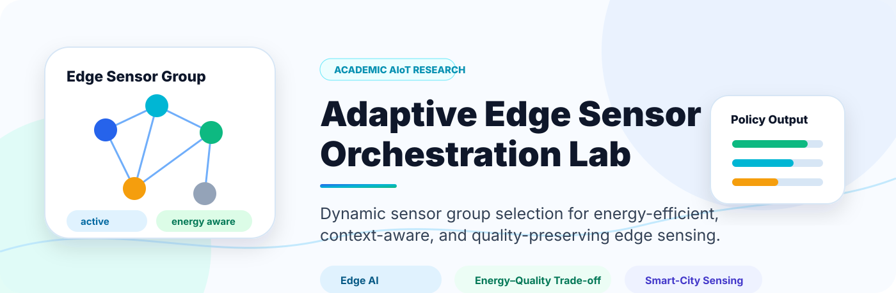
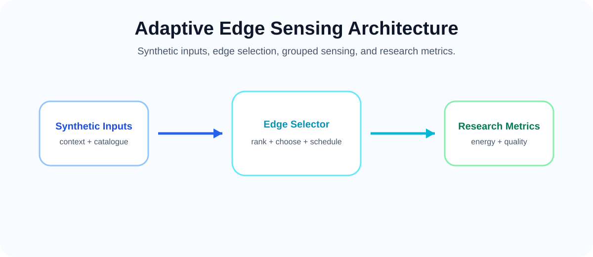
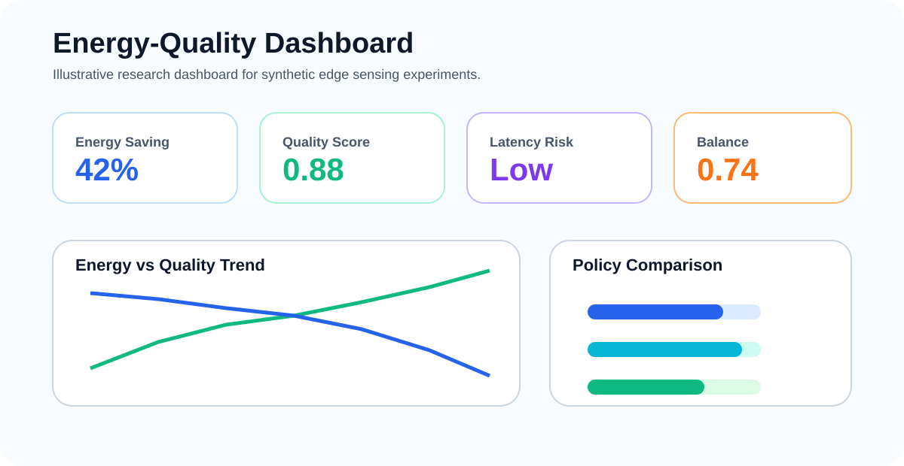

<p align="center">
  
</p>

<h1 align="center">Adaptive Edge Sensor Orchestration Lab</h1>

<p align="center">
  <b>Academic AIoT research prototype for adaptive edge sensing, group selection, and energy-quality trade-off analysis using synthetic scenarios.</b>
</p>

<p align="center">
  
  
  
  
</p>

---

## Overview

**Adaptive Edge Sensor Orchestration Lab** studies how edge intelligence can form compact sensing groups under changing synthetic smart-city scenarios. The project focuses on energy-aware scheduling, quality preservation, candidate ranking, and reproducible evaluation.

This is a research and teaching repository. It uses synthetic examples only and does not operate real devices or make deployment claims.

---

## Research Question

> Can adaptive edge sensing reduce estimated cost while preserving useful sensing quality?

---

## Research Objectives

| Objective | Description |
|---|---|
| Adaptive group selection | Choose a compact group instead of using every candidate. |
| Energy-quality trade-off | Compare estimated cost with expected sensing quality. |
| Context awareness | Use synthetic demand, complexity, priority, and load variables. |
| Reproducible evaluation | Compare strategies with shared assumptions and documented metrics. |

---

## Architecture

<p align="center">
  
</p>

---

## Workflow

<p align="center">
  
</p>

```text
Synthetic context -> candidate ranking -> compact group -> metric report
```

---

## Dashboard Concept

<p align="center">
  
</p>

---

## Quick Start

```bash
git clone https://github.com/Hirakhyzer/adaptive-edge-sensor-orchestration-lab.git
cd adaptive-edge-sensor-orchestration-lab
python -m venv .venv
source .venv/bin/activate  # Windows: .venv\\Scripts\\activate
python -m pip install -e .
python -m pip install -r requirements.txt
python examples/run_orchestration_demo.py
pytest
```

---

## Repository Structure

```text
adaptive-edge-sensor-orchestration-lab/
├── assets/
│   ├── banner.svg
│   ├── sensor-orchestration-architecture.svg
│   ├── workflow.svg
│   └── dashboard.svg
├── data/
│   └── README.md
├── docs/
│   ├── research-background.md
│   ├── system-design.md
│   ├── evaluation-methodology.md
│   ├── responsible-aiot-boundary.md
│   └── scenario-catalogue.md
├── examples/
│   └── run_orchestration_demo.py
├── src/edge_sensor_orchestration/
│   ├── schema.py
│   ├── orchestrator.py
│   └── evaluation.py
└── tests/
    └── test_orchestration.py
```

---

## Responsible AIoT Boundary

This repository is for synthetic experimentation, research, and education. Real-world use would require safety, privacy, cybersecurity, and governance review.

---

## License

Released under the [MIT License](LICENSE).

---

## Author

Created by **Hira Khyzer** as an academic AIoT and smart-city sensing research prototype.